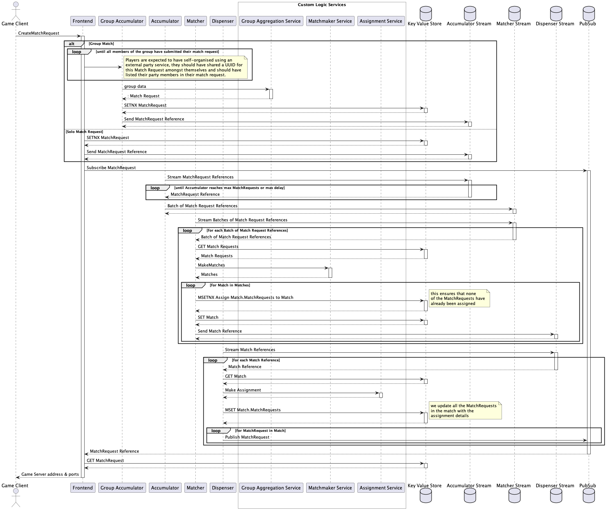

# rivalry

This is intended as a rework of open-match. 
The original objective was to move from having a synchroniser singleton, 
to using a streaming database which should increase scope for capacity and resilience.

Other beneficial design changes:
1. In open-match Tickets can be submitted into the system that do not match any 
   existing match profiles. In rivalry a ticket is sent onto a stream specific 
   to the profile the ticket matches, if a ticket doesn't match a profile an error 
   is returned to the client.
2. In open-match frontend.WatchAssignments polls the database 
   (every 30 milliseconds by default) until the Assignment value is no longer empty.
   rivalry uses a publish-subscribe system to announce when tickets have been updated.
3. In open-match the director is a singleton that triggers when matchmaking occurs, 
   disseminates match profiles to the open-match backend, allocate a game server and  
   assign the game server connection string to the tickets. 

Below is a sequence diagram that gives an overview of how rivalry works

Remaining Work:
1. Add Backfill logic into dispensor
2. Tidy away data once matches are no longer needed
3. Add configure for Kubernetes deployment
   1. Helm Chart
   2. Create an Operator and Match Profile CRD that ensures we have an accumulator deployment for each Match Profile
4. Load testing

Improvement Ideas:
1. Split the accumulator up into 2 services, moving the work of makeMatches into another service that would consume
   batches of Tickets and Backfill from the accumulator and attempt to create Matches from them.
2. If we are worried about tickets getting lost in the streams we could update an index, with the current time, 
   each time a service handles a Ticket and create a worker to requeue tickets that have an index over a threshold. 
3. Match Profiles have a very limited ability to filter, this could be expanded, perhaps to be more like  a
   [Boolean Query](https://www.elastic.co/guide/en/elasticsearch/reference/current/query-dsl-bool-query.html)
   in Elasticsearch.
4. Group Matchmaking

Chores:
1. Use buf to generate and lint proto files
